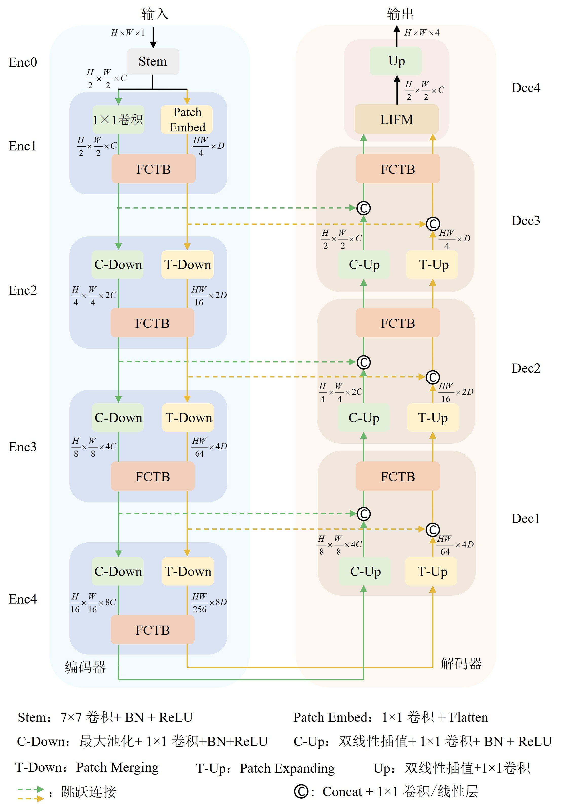
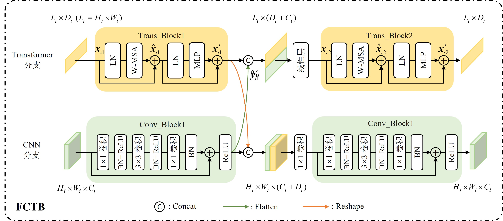

# UConvTrans: A Dual-Flow Cardiac Image Segmentation Network by Global and Local integration

## 描述
论文首发地址: [知网链接](https://kns.cnki.net/kcms/detail/31.1466.U.20220915.1456.003.html)
## 整体结构图

## FCTB 结构图

